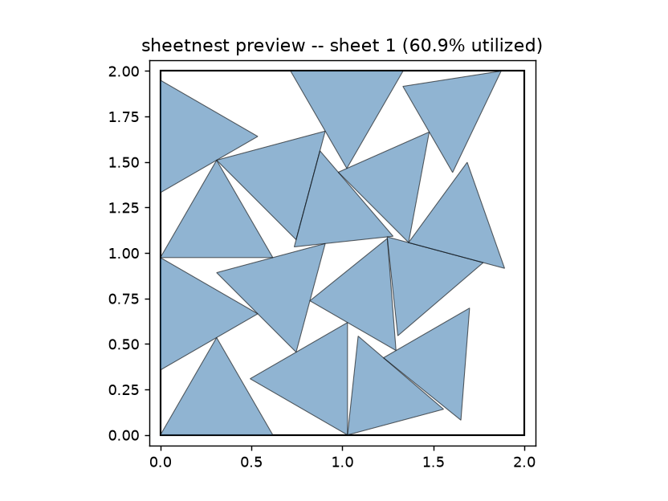

# pyFit (or, How Our Heroine Stopped Wasting Perfectly Good Aluminum)

Cutting two hundred and forty triangular panels for a geodesic secret laboratory is, it turns out, a great deal easier than figuring out how to actually get two hundred and forty triangles out of a stack of aluminum sheets without half of each sheet ending up as scrap. Even a supervillain has a materials budget, and "just buy more aluminum" stopped being a satisfying answer somewhere around the fourth wasted sheet. Our heroine had pyLair telling her exactly which panel shapes she needed and how many of each — but nothing telling her how to *arrange* them.

That arranging problem has a name — nesting, or irregular bin-packing — and it turns out to be interesting (and hard) enough to deserve its own tool rather than a bolted-on pyLair feature. So: pyFit.

## What It Does

pyFit takes a list of 2D shapes, how many of each you need, and the size of your sheet stock, and figures out how to lay them out with as little wasted material as possible. Feed it a job description — sheet dimensions plus a list of parts, each either an inline polygon or a DXF file — and it hands back one DXF per sheet actually used (ready to load into a laser cutter or CNC router) plus a JSON report of exactly where every piece landed, at what rotation, and whether it got flipped over.

Critically, it is **not** a pyLair feature. It is its own standalone project — [pyLair](https://github.com/badass-data-science/pyLair-agentic-geodesics) lives in its own repo entirely — with zero code dependency in either direction. Our heroine's secret lair is not the only thing that will eventually need cutting — control panel faceplates, viewport bezels, whatever comes next — and she'd rather solve "how do I not waste sheet stock" once, generally, than reinvent it every time a new project needs shapes cut from flat material.

## Why We Need It

pyLair's Bill of Materials is extremely precise about *what* you need: exactly which triangular panel shapes, exactly how many of each, down to the millimeter. What it has never had an opinion on is *how those shapes actually fit on a physical sheet*. Left to her own devices, our heroine's first instinct was to eyeball it — draw a triangle, copy-paste it around the sheet in her CAD software, squint, adjust, repeat two hundred and forty times. This is exactly the kind of tedious, error-prone, "a computer should be doing this" work that got pyLair written in the first place, so the same instinct applied here.

The catch: this isn't a simple problem. Deciding how to optimally pack arbitrary shapes onto a sheet is what computer scientists call NP-hard, which is a polite way of saying "there is no known shortcut, and there provably might never be one." Real nesting software doesn't solve it exactly — it uses heuristics that get *close* to optimal, fast enough to actually be useful. pyFit does the same.

## How It Works

**No-fit-polygons.** The core idea nesting software leans on is the no-fit-polygon (NFP): given a shape that's already placed on the sheet, the NFP describes the "keep-out zone" for a second shape's reference point — step inside that zone and the two shapes overlap; step outside it (or land exactly on its boundary) and they don't. Computing this correctly, especially for oddly-shaped polygons, is genuinely fiddly geometry — the kind of thing where hand-rolling your own math is a great way to introduce a bug that only shows up on the fortieth shape you nest. So pyFit leans on [`pyclipper`](https://github.com/fonttools/pyclipper) (mature C++ polygon-clipping bindings) to compute the underlying Minkowski-sum math, and [`shapely`](https://shapely.readthedocs.io/) for general polygon geometry — the only two places in this project where our heroine (via Claude Code) chose to stand on a trusted library's shoulders rather than build from scratch, exactly because this particular sub-problem is a solved one elsewhere, unlike pyLair's actual specialty (geodesic subdivision math).

**Bottom-left-fill.** With NFPs in hand, pyFit places the largest shapes first (so the big pieces claim their space before the small ones have to awkwardly fill in around them), and for each shape, tries a range of rotation angles — and mirrored orientations, unless a shape is flagged as mirror-sensitive — picking whichever valid position lands furthest to the left, then furthest to the bottom. Every shape checks every already-opened sheet in order, earliest first, before a new one gets opened — so leftover scrap an earlier, oddly-shaped piece left behind gets a real chance to be filled by a later, smaller one, instead of sitting there unused the moment a bigger piece forces a fresh sheet open.

**Reusing scrap, at a price.** That "check every sheet first" behavior didn't ship as the original design — sheets used to be packed independently, each one filled up and abandoned in turn, leftover space and all. Fixing that was a genuinely satisfying, contained change... until our heroine ran it against a real job (forty actual triangular panels straight out of pyLair) and watched it take three times as long as before. Trying every earlier sheet means every one of those tries can mean a full no-fit-polygon search against everything already sitting there, and irregular triangles waste a lot of *area* without leaving anything a later shape can actually use — so a sheet can look like it has plenty of room by the numbers while genuinely having none by the shape. The fix was two-fold: a cheap, exact area check that skips a sheet outright when there plainly isn't enough room left for a given shape (safe, since it only ever rules out sheets that truly cannot fit), and leaning on the rotation-step knob (`-R/--rotation-step`) that already existed — fewer tried angles means fewer of those expensive per-sheet searches, and measured performance on that same real job came right back down to roughly what it was before. The moral, consistent with everything else that's gone wrong (in illuminating ways) on this project so far: don't trust a change is free until you've actually run it against real, not synthetic, data.

**A quick look before committing.** `-P/--preview` renders each sheet's layout — the sheet boundary plus every placed shape's outline, labeled with utilization percentage — as a PNG, the same idea as pyLair's own `-P` flag for a dome. Small, self-contained, and exactly the kind of thing that turns "did that actually work?" into a two-second glance instead of opening a DXF viewer.

**The ghost hole.** While building this, Claude Code hit a genuinely subtle bug worth telling on: the very first hand-computable test case (two identically-sized squares) passed cleanly, so it looked safe to build on top of. A second test case — a small square swept around a much larger one — revealed that the underlying Clipper library doesn't actually hand back a clean, resolved shape; it hands back raw sweep geometry that, for mismatched shape sizes, includes an inner contour that *looks* like a hole in the result but mathematically cannot be one (the Minkowski sum of two solid convex shapes is always itself solid — there's no way to get a legitimate hole out of it). The first test case happened to be exactly the one size ratio where that spurious inner contour doesn't show up, so it didn't catch anything. The fix — union everything Clipper hands back as solid regions instead of trusting the library's own hole-marking convention — was confirmed against an independently-computed ground truth (the convex hull of every pairwise vertex sum, a completely different method for computing the same quantity) before being trusted. The lesson, which now lives in project memory for next time: one passing hand-computable test case is not enough — you have to vary the *proportions* of the case, not just try a second random one, before you can trust a geometry primitive.

**Chirality-aware mirroring.** pyLair's own panel Bill of Materials already flags when two "identical" triangular panels are actually mirror images of each other rather than true duplicates — relevant for directional materials like wood grain or a printed film. pyFit's `allow_mirror` flag on each part plugs directly into that: set it to `false` for a chirality-sensitive shape, and the nester will only ever rotate it, never flip it, so the output never quietly asks you to cut a mirror image of a piece that specifically shouldn't be one.

## How It Connects to pyLair

The connection is deliberately shallow: a file, not an import statement. `pylair ... -T` writes one DXF cutting template per unique panel shape and reports exactly how many of each are needed; point a pyFit job spec's `"dxf"` field at those files and `"quantity"` at those counts, and pyFit will figure out how to actually lay them out on real stock. Neither project imports the other, and pyFit's DXF importer has no idea (and no need to know) that a shape it's reading came from a geodesic dome rather than, say, a birdhouse or a cosplay prop. pyLair tells you what to cut; pyFit tells you where to cut it from.

Here's that connection in practice — real triangular panel templates straight out of a `pylair -T` run, packed by pyFit onto a sheet of stock:

Worth being honest about what this picture shows: 60.9% utilized, not a tight tiling. Real pyLair triangles don't pack as densely as, say, plain squares under pyFit's bottom-left-fill heuristic — a finer rotation step only nudges that number a little (see "Known limitations" in the README), which is a genuine limitation of the algorithm, not a rendering artifact or a bad test case. It's still a real, verified result: this exact job was independently re-checked (outside pyFit's own reporting) for zero overlaps and full containment within the sheet boundary.

## An Agentic Interface, Not Just a Command Line

pyFit now speaks [MCP](https://modelcontextprotocol.io) (the Model Context Protocol), the same way pyLair does. Install the optional `mcp` extra and `pyfit-mcp` starts a small server exposing four tools an LLM assistant can call directly: `design_nest` (pack and return a utilization summary, no files), `preview_nest` (pack and return each sheet's layout as an inline image), `get_nest_report` (pack and return the full structured placement data), and `export_nest` (pack and actually write the DXF/PNG files, the same output the CLI produces). All four share one `pyfit/api.py` core with the `pyfit` CLI itself, so there's exactly one place job-spec parsing and packing logic lives, not two copies quietly drifting apart.

**Why this matters, and not just as a checkbox feature.** Without it, an assistant helping design a cutting job has exactly one option: shell out to the `pyfit` command, capture stdout, and parse JSON out of a text blob — fragile (a stray print statement breaks the parse), opaque (a preview image means writing a PNG to some path and hoping the assistant's environment can then go read it back), and slow to iterate with (every "try a smaller rotation step" or "what if the sheet were bigger" round-trips through a whole subprocess). An MCP tool call skips all of that: the assistant gets back structured data or an inline image directly, in the same turn, with no file path to invent and no stdout to scrape. For a job that's inherently exploratory — "how many of these panels actually fit if I bump the sheet width by six inches" isn't a question with one right answer, it's something you try — that tight a loop is the difference between an assistant that can genuinely help you tune a nesting job and one that can only run it once and report back.

It's also the more honest reflection of how this project actually came to exist. pyFit wasn't hand-written and later cleaned up by an agent — it was designed and built by one, turn by turn, from a standing start (see the AI Use Statement below). Giving it an MCP interface means the same *kind* of collaborator that built it can now use it directly too, without a human in the middle relaying CLI invocations back and forth. And because pyLair already speaks MCP, an assistant working across both projects — turning a dome design into an actual cutting job — can now call tools in either one through the same protocol, instead of one being agent-native and the other requiring a human to bridge the gap.

**A skill, not just a protocol.** MCP assumes a client that speaks MCP. Not every agent does, and some — like [OpenClaw](https://docs.openclaw.ai) — instead work from *skills*: a `SKILL.md` file that teaches the agent when and how to reach for a given command-line tool, no protocol handshake involved. pyFit ships one of those too, at `skills/pyfit/SKILL.md`, alongside `openclaw.config.snippet.jsonc` to register it — a second, complementary agentic interface for agents that shell out rather than speak MCP, built on the same job-spec documentation the CLI and README already had to get right.

## Is It Still Working, or Did It Die?

Reusing scrap across sheets (see above) bought pyFit better packing at the cost of real wall-clock time on a large job — and a large job with a fine rotation step can now genuinely run for tens of seconds or minutes. That's a problem on its own even for a patient human staring at a terminal, and it's a *worse* one for an agent: an MCP tool call that just sits there with nothing coming back is indistinguishable, from the calling assistant's side, from one that's hung. So both interfaces now report progress while a job runs, not just at the end.

**On the command line**, `pyfit` prints a `placed N/M parts (checking sheet K)...` line to stderr every couple of seconds while it works, throttled so a fast job stays silent and a slow one gets a heartbeat instead of a wall of text. It goes to stderr specifically so it never gets mixed into stdout's JSON report — pipe `pyfit`'s output into `jq` or a file and the heartbeat simply isn't there. `-q/--quiet` turns it off entirely for anyone who'd rather just wait.

**Over MCP**, the same heartbeat becomes a proper [progress notification](https://modelcontextprotocol.io) the calling assistant can surface however it likes, if it asked for one. This took more than adding a print statement: MCP's own server framework runs a tool function's code directly on the connection's single event loop, which means an ordinary synchronous tool blocks that loop for its entire duration — there's no window in which a notification could go out mid-call, no matter what the tool does internally. The fix was to move the actual packing work onto a background thread and let the tool function `await` it, freeing the event loop to keep sending notifications the whole time the thread grinds away. Tested against a real multi-second job with a stand-in for the MCP client, the notifications showed up spread across the entire call — not one lump at the start and another at the end — which is the actual property that matters: proof the assistant genuinely hears "still working" throughout, not just eventually "done."

Both heartbeats trace back to one shared signal, not two independent ones: the packer itself now takes an `on_progress` callback, fired every time it tries fitting the current shape onto a sheet. The CLI turns that into a throttled stderr line; the MCP server turns it into a protocol notification. One source of truth, two presentations — which is the same reason `pyfit/api.py` exists at all (see above): a fact this project needs to know shouldn't have two separate places to go stale.

## Next Steps

* Done, actually: reusing scrap across sheets. Every shape now checks every already-opened sheet before starting a new one, at the cost of real search time on large jobs (see "Reusing scrap, at a price" above) — mitigated, not eliminated, by an exact area pre-check and the existing rotation-step knob.
* Done, actually: a preview image. `-P/--preview` renders a quick PNG of each sheet's layout, the same idea as pyLair's own preview flag.
* Done, actually: an MCP interface. `pyfit-mcp` exposes packing, preview, reporting, and file export as tools an agent can call directly, the same idea as pyLair's own MCP server (see "An Agentic Interface, Not Just a Command Line" above).
* Done, actually: progress reporting on long jobs. A stderr heartbeat on the CLI, and real MCP progress notifications from the agentic interface, so a slow scrap-reuse-heavy job doesn't look frozen on either side (see "Is It Still Working, or Did It Die?" above).
* Done, actually: OpenClaw skill support. `skills/pyfit/SKILL.md` plus `openclaw.config.snippet.jsonc` let an OpenClaw agent invoke the `pyfit` CLI directly, no MCP client required (see "A skill, not just a protocol" above).
* The bottom-left-fill candidate search isn't fully exhaustive — it considers NFP vertices, NFP-boundary crossings, and sheet corners, which is enough to perfectly tile trivially-tileable cases, but true full NFP-boundary tracing would occasionally find a tighter fit than the current heuristic does.
* A proper refinement pass on top of the base placement — simulated annealing or a genetic reordering of the placement sequence, the way more sophisticated nesting tools do — would likely close a meaningful chunk of the remaining gap between "good heuristic" and "actually optimal."
* Rectangular sheets only, for now. Real stock sometimes has irregular shape, existing cutouts, or is itself an offcut from a previous job — none of that is supported yet.

## Conclusion

Our heroine now has a computer figuring out both *what* shapes her secret laboratory needs and *how to cut them out of the smallest possible pile of aluminum* — freeing her up to worry about the genuinely hard problems, like where exactly to hide the door.

## Works Consulted

* [`shapely`](https://shapely.readthedocs.io/). General-purpose 2D geometry: polygon area, bounds, intersection tests, and the union operation that resolved the Minkowski-sum ghost-hole bug described above.
* [`pyclipper`](https://github.com/fonttools/pyclipper). Python bindings to the Clipper polygon-clipping library, used for the underlying no-fit-polygon (Minkowski-sum) computation.
* The general family of bottom-left-fill, no-fit-polygon nesting algorithms as implemented by tools like SVGnest and DeepNest, which pyFit's own heuristic follows the shape of (though its implementation is original, not ported from either).
* The [Model Context Protocol](https://modelcontextprotocol.io) and its Python `mcp`/`FastMCP` server implementation, used for the agentic interface described above — the same library and tool-design pattern (design/preview/report/export) pyLair's own MCP server already established.
* Python's `asyncio` (`to_thread` and `run_coroutine_threadsafe`), used to bridge the synchronous packer's progress callback onto the MCP server's event loop without blocking it, as described in "Is It Still Working, or Did It Die?" above.
* [OpenClaw](https://docs.openclaw.ai)'s `SKILL.md` format and skill-discovery/configuration conventions, used for the skill described above.

## Code

pyFit is available [here](https://github.com/badass-data-science/pyFit-agentic-polygon-nesting).

## AI Use Statement

Unlike pyLair, which our heroine wrote by hand before bringing in Claude Code for refactoring and new features, pyFit was designed and built collaboratively with Claude Code from a standing start: she scoped the requirements (a general-purpose tool, not a pyLair module; a real NFP-based nester, not a bounding-box approximation; ship a working MVP, not just a design doc) and reviewed the results, while Claude Code designed the module layout, implemented the algorithm, caught and fixed the Minkowski-sum bug described above, and wrote the test suite and this post's technical explanations. She picked two items off this post's own Next Steps list (scrap reuse and the preview image) and had Claude Code implement both — including catching, measuring, and documenting the real performance cost scrap reuse turned out to have, rather than letting it ship as a silent regression on large jobs. She had Claude Code add the MCP interface described above, mirroring pyLair's own design/preview/report/export tool pattern and factoring the shared packing logic out of the CLI into `pyfit/api.py` in the process, so the two entry points can't quietly drift apart. Most recently, she had Claude Code add progress reporting for long jobs on both interfaces — including diagnosing, from first principles, exactly why a synchronous MCP tool can't emit a mid-call notification at all (not just "doesn't yet"), and verifying the fix against a real multi-second job rather than trusting that adding an `await` and a callback was sufficient on its own. She also had Claude Code research OpenClaw's actual skill format and configuration schema before writing `skills/pyfit/SKILL.md` and `openclaw.config.snippet.jsonc`, rather than guessing at conventions for a tool neither of them had built for before.

## Tags

* geodesic
* nesting
* bin packing
* no-fit-polygon
* NFP
* laser cutting
* CNC
* sheet metal
* DXF
* Python
* shapely
* pyclipper
* Claude Code
* agentic AI
* MCP
* Model Context Protocol
* asyncio
* progress reporting
* FastMCP
* OpenClaw
* skills
* Ultimate Cunning Master Plan
